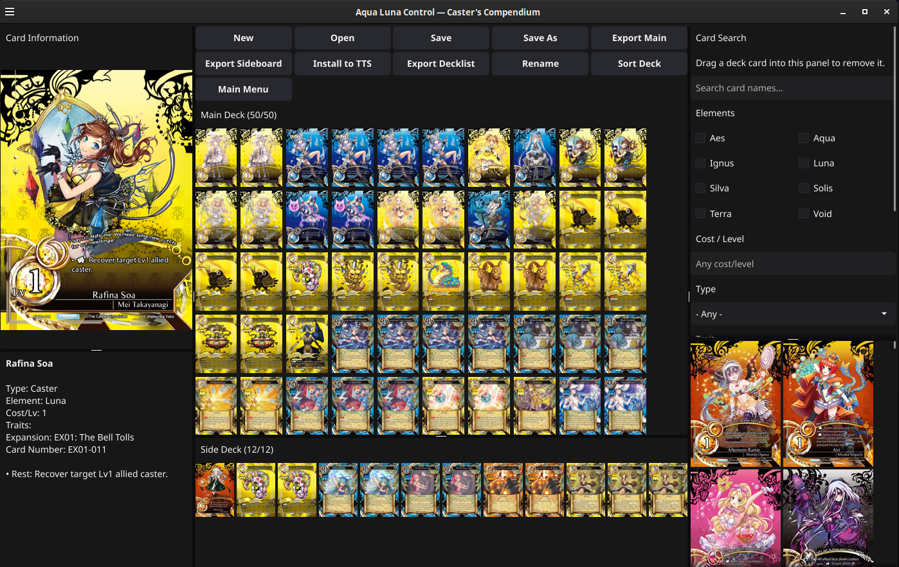

# Caster's Compendium

[](https://github.com/HybridUofA/casters-compendium/actions/workflows/ci.yml)
[](https://github.com/HybridUofA/casters-compendium/releases/latest)
[](go.mod)

Caster's Compendium is a desktop card browser and deck builder for Caster
Chronicles. It supports editable JSON decks, Speedrobo-compatible text
decklists, Tabletop Simulator image sheets, and portable multiplayer-ready
Tabletop Simulator objects backed by publisher-authorized hosted assets.

Project website: <https://casterscompendium.com/>

> **Project status:** Active public alpha. Deck and catalog formats are
> versioned, but user-interface behavior and planned simulator components may
> continue to evolve before a stable 1.0 release.



AI assistance and project authorship are documented in
[AI_STATEMENT.md](AI_STATEMENT.md). The original foundation through the
`Checkpoint before Codex` commit was maintainer-written; implementation through
the v0.1.3 repository and website migration included Codex assistance under
maintainer direction and review. The statement also documents the automated
tests and explicitly authorized production assistance used for v0.1.4's
Tabletop Simulator integration and the complete v0.1.5 hosted-catalog patch.

## Features

### Deck building

- Build, load, rename, sort, and save complete main decks and sideboards while
  preserving each card's maximum copy limit.
- Drag cards from search results into either deck area, move them between the
  main deck and sideboard, and reorder them for personal theorycrafting and
  custom organization. **Sort Deck** restores the standard ordering.
- Select individual card copies with Control-click, or Command-click on macOS,
  then drag the selected batch within or between deck zones while preserving
  its relative order.
- Drag a deck card onto the Card Search panel to remove one copy.
- Preview card artwork on hover or click and read the card's full details in the
  information panel.
- Follow the operating-system theme or select a persistent light or dark theme.

### Search and card data

- Search the full card database by name, card type, trait, rules keyword,
  element, expansion, cost/level, and playtesting status.
- Extract keyword filters automatically from current card ability text instead
  of relying on a fixed keyword list.
- Download and cache the card database, artwork, and thumbnails locally for
  convenient reuse and faster subsequent launches.
- Download initial card assets concurrently from the project-hosted,
  publisher-authorized catalog.
- Verify the complete normalized database against its published SHA-256 digest,
  prompt when the approved catalog changes, or force a refresh from the main
  menu.

### Import, sharing, and export

- Import and save editable JSON deck files for sharing between players.
- Import and export the human-readable decklist format published by Speedrobo
  Games, including deck metadata, set names, totals, and sideboards.
- Export both main-deck and sideboard image sheets for Tabletop Simulator using
  the bundled card-back asset.
- Install a complete deck directly into Tabletop Simulator with one click.
  Shared HTTPS sheets load automatically for multiplayer participants. The
  original local-sheet installer remains an automatic offline fallback.

### Desktop applications

- Download precompiled applications for Windows, macOS Intel, macOS Apple
  Silicon, and Linux x64.
- Install native packages on Debian and Ubuntu (`.deb`) or Arch Linux
  (`.pkg.tar.zst`).

## Roadmap

### What's new in v0.1.5

- Export multiplayer-ready TTS objects backed by reusable hosted sheets.
- Retrieve normalized card data and artwork from the publisher-authorized
  Caster's Compendium catalog instead of requiring each installation to query
  Speedrobo.
- Verify complete database snapshots and publish immutable catalog releases
  through an atomic current-version pointer.
- Fall back to the v0.1.4 local TTS exporter when hosted assets are unavailable.

### What's new in v0.1.4

- Select multiple individual card copies with Control-click, or Command-click on
  macOS.
- Drag the selected cards to a new position as one batch while preserving their
  relative order.
- Export a complete deck to Tabletop Simulator in one action.
- Import and export text decklists using the format published by Speedrobo
  Games.
- Complete the migration to Fyne's current UI-thread dispatch model.

The one-click Tabletop Simulator export and Speedrobo-compatible text decklist
support were requested directly by Speedrobo Games.

### Future deckbuilder work

- Preload the Duel Deck decklists and provide a deck-selection dropdown.
- Check automatically and manually for new application releases, linking users
  directly to release notes and downloads.
- Continue working directly with Speedrobo on art assets and prototype cards.
- Adding optional backgrounds, primarily eight element-themed designs and
  potentially five designs for the OC-tier Casters, subject to their creators'
  permission.

### Planned for v0.2.0

v0.2.0 is planned to introduce the first rudimentary simulator. Simulator work
is a large, experimental undertaking and remains a work in progress without a
promised delivery date.

## How to use the deck builder

1. Choose **Make a New Deck**, or choose **Load a Deck** to open an existing
   editable JSON deck or text decklist.
2. Find cards with the name, element, cost/level, type, trait, keyword,
   expansion, and playtesting filters in the Card Search panel. Keyword choices
   are extracted from the current card ability data, so newly published rules
   labels can appear without an application update.
3. Hover over a card to display its full image and card details. Clicking or
   tapping also works on devices without pointer hover.
4. Right-click a search result to add one copy to the Main Deck. Hold **Shift**
   while right-clicking to add one copy to the Side Deck. A search result can
   also be dragged directly into either deck area.
5. **Right-click a card already in the Main Deck or Side Deck to remove one
   copy, or drag it onto the Card Search panel.** Drag a deck card within or
   between deck areas to reorder or move it.
6. Hold **Control**, or **Command** on macOS, and click individual deck copies
   to select a batch. Release the key, then drag any selected copy to move the
   batch within or between deck areas.
7. Choose **Sort Deck** to restore the standard automatic ordering.

The deck controls provide the following file and export operations:

- **Save** and **Save As** write the editable JSON deck format.
- **Export Decklist** writes the human-readable text format used by
  Speedrobo Games decklists.
- **Export Main** and **Export Sideboard** create Tabletop Simulator PNG sheets.
- **Install to TTS** writes a complete saved object referencing shared online
  assets into the detected Tabletop Simulator data directory. If the hosted
  catalog is unavailable, it installs local assets and explains the multiplayer
  limitation.
- **Rename** changes the deck's display and default export name.
- **Main Menu** returns to deck creation, file conversion, database update,
  appearance settings, and the built-in **How to Use** guide.

From the main menu, **Generate Deck Image from Decklist** creates a Tabletop
Simulator sheet without opening the deck editor, while **Generate Decklist
File** converts an editable JSON deck to the text interchange format.

## Running from source

Install Go and the native prerequisites listed in the
[Fyne quick-start documentation](https://docs.fyne.io/started/quick/), then run:

```sh
go run -tags migrated_fynedo ./cmd/deckbuilder
```

Tests, including the stricter Fyne threading migration, run with:

```sh
go test ./...
go test -tags migrated_fynedo ./...
```

Pull requests also run formatting, vetting, both test configurations, a Linux
build, and Go vulnerability analysis through the dedicated continuous
integration workflow. See [CONTRIBUTING.md](CONTRIBUTING.md) for the complete
development and submission process.

## Local application data

The applications share downloaded data under Fyne's per-user configuration
directory. The stable storage application ID remains
`io.github.hybriduofa.casterdeckbuilder`, even though the display name changed,
so existing deckbuilder installations continue to use the same files and the
future simulator will not create a second card database or image cache.

- Linux: `${XDG_CONFIG_HOME:-$HOME/.config}/fyne/io.github.hybriduofa.casterdeckbuilder`
- macOS: `~/Library/Preferences/fyne/io.github.hybriduofa.casterdeckbuilder`
- Windows: `%APPDATA%\fyne\io.github.hybriduofa.casterdeckbuilder`

The directory contains `cards.json`, `cardlist.sha256`, `images/`, `thumbnails/`,
and the setup-completion marker. Deck and export files remain wherever the user
selected in the save dialog.

## Repository architecture

The repository is organized as one Go module with application-specific code
around shared card and game packages:

```text
cmd/
  deckbuilder/          Deckbuilder executable and Fyne metadata
  simulator/            Reserved simulator command
  tools/                Card-data, catalog publishing, and legacy CLI utilities
internal/
  carddata/             Catalog distribution, local cache, and normalization
  deckbuilder/          Deckbuilder application, UI, and local/hosted TTS export
  deckio/               Shared JSON and text deck formats
  game/                 Simulator-safe card and deck domain logic
  simulator/            Reserved simulator packages
  sources/              External card-data clients
data/                    Published card snapshot and bootstrap artwork
packaging/               Linux distribution and desktop package definitions
```

Packages under `internal/game` do not depend on Fyne, HTTP, or filesystem
storage. Both applications can consume the same game models, `deckio` formats,
and OS-local `carddata` paths without importing one another.

## Desktop packages and releases

The `Package desktop applications` GitHub Actions workflow builds native
artifacts for:

- Windows x64
- macOS Intel
- macOS Apple Silicon
- Linux x64
- Debian and Ubuntu x64 (`.deb`)
- Arch Linux x64 (`.pkg.tar.zst`)

A manual workflow run stores packages as build artifacts. Pushing a version tag
such as `v0.1.5` builds the same packages and publishes them as GitHub Release
assets. Tagged releases also publish `SHA256SUMS.txt`, an SPDX software bill of
materials, and GitHub artifact attestations linking downloads to their source
commit and build workflow.

After downloading a release, verify its checksum from the download directory:

```sh
sha256sum --check SHA256SUMS.txt
```

GitHub CLI users can additionally verify build provenance:

```sh
gh attestation verify PATH/TO/DOWNLOAD \
  --repo HybridUofA/casters-compendium
```

The macOS and Windows packages are currently unsigned; operating-system
security prompts may therefore require the user to explicitly allow the first
launch. Code signing can be added later when the appropriate Apple Developer
and Windows signing certificates are available.

Fyne's packaging tool uses `data/images/shadow.png` as the application icon and
embeds `MTD-back-ver01.png` separately for Tabletop Simulator exports.

Debian and Ubuntu users can install the native package with:

```sh
sudo apt install ./casters-compendium_0.1.5_amd64.deb
```

Arch Linux users can install the native package with:

```sh
sudo pacman -U casters-compendium-0.1.5-1-x86_64.pkg.tar.zst
```

## Known limitations

- Windows and macOS packages are not yet code-signed or notarized.
- The application updater is planned but not yet implemented; releases are
  downloaded from GitHub manually.
- Hosted TTS export requires network access. A local fallback remains available,
  but remote multiplayer participants may not see locally generated assets.
- The simulator is experimental roadmap work and is not included as a usable
  application in current releases.

## Contributing and security

Focused bug fixes, tests, documentation, and discussed features are welcome.
Read [CONTRIBUTING.md](CONTRIBUTING.md) before opening a pull request and use
[SECURITY.md](SECURITY.md) for private vulnerability reporting. Community
participation is governed by [CODE_OF_CONDUCT.md](CODE_OF_CONDUCT.md).

The project does not yet declare a general code license. Card artwork, game
data, names, and other third-party intellectual property are not implicitly
licensed for reuse; see the website's
[IP and credits page](https://casterscompendium.com/rights.html).
